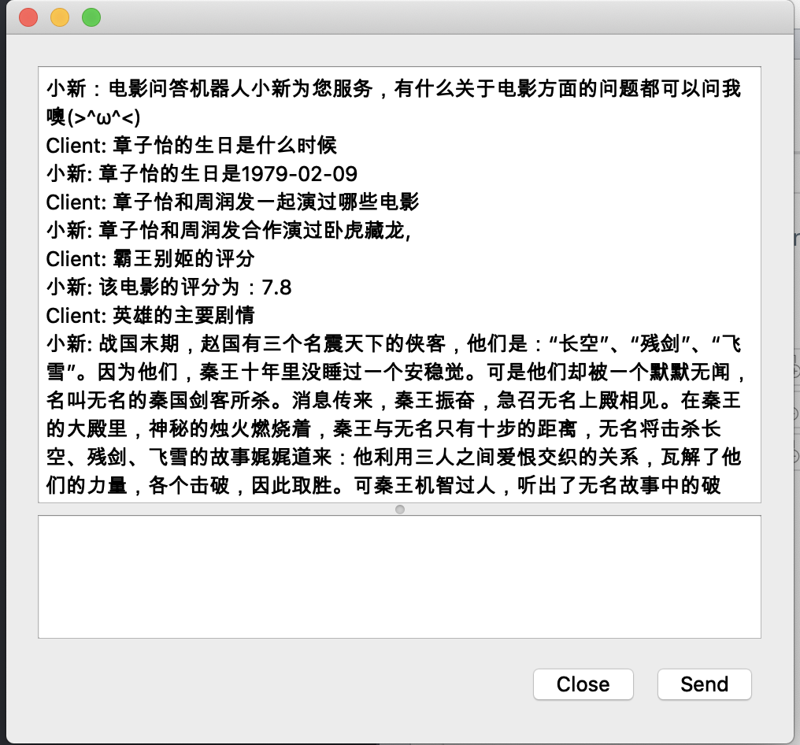

## moive-question-robot-based-on-spark-neo4j

配置环境: 

pyspark 2.4.4

py4j 0.10.7

Neo4j 1.2.3

configuration environment:

pyspark 2.4.4

py4j 0.10.7

Neo4j 1.2.3

## supplement

In the another repository, we also build a spark framework with python. So we also deploy our work on our spark framework. If you are interested in this part, you can git anonther repository and reproduce our work.

## sample

- python client.py
- python server.py

Then you can get the UI to communicate with the robot.

## QA
If you have any question with my code, just connect with me.

email: [Lihuadong97@163.com](Lihuadong97@163.com)
